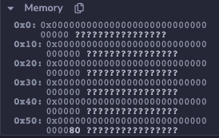
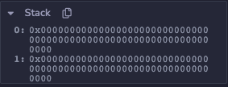
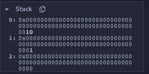
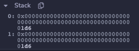
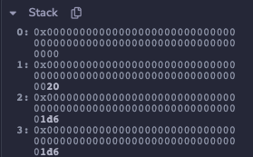

# EVM虚拟机3 合约部署和调用实例分析


上一篇文章我们做了EVM虚拟机整体的源码分析，接下来我们用一个简单的合约来看看虚拟机是如何完成创建和调用的流程

合约如下

TxTest.sol

```
pragma solidity ^0.8.0;

contract TxTest{
    function add()public pure returns(uint){
        return 1+2;
    }
}
```


## 合约部署


### 部署合约交易Input解析

部署完该合约后，我们可以在交易中拿到他的input：

```
0x608060405234801561001057600080fd5b5060b68061001f6000396000f3fe6080604052348015600f57600080fd5b506004361060285760003560e01c80634f2be91f14602d575b600080fd5b60336047565b604051603e9190605d565b60405180910390f35b60006003905090565b6057816076565b82525050565b6000602082019050607060008301846050565b92915050565b600081905091905056fea2646970667358221220012e45e3e4a233ceaf9f107a900940bd334a80637f531ce2336d3b61dda7789364736f6c63430008070033
```


### 1.解析input第0～4个字节：

6080604052

```
PUSH1 80
PUSH1 40
MSTORE
```

##### 操作码:

callContext.contract.Code = input 

因此 * pc += 1后  callContext.contract.Code[* pc]=0x80 

```go
// opPush1 is a specialized version of pushN
func opPush1(pc *uint64, interpreter *EVMInterpreter, callContext *callCtx) ([]byte, error) {
   var (
      codeLen = uint64(len(callContext.contract.Code)) //len(callContext.contract.Code) 一共需要执行的步骤 也即栈所需要的深度
      integer = interpreter.intPool.get() //intpool.pop()
   )
   *pc += 1
   if *pc < codeLen {
      callContext.stack.push(integer.SetUint64(uint64(callContext.contract.Code[*pc])))
   } else {
      callContext.stack.push(integer.SetUint64(0))
   }
   return nil, nil
}

func opMstore(pc *uint64, interpreter *EVMInterpreter, callContext *callCtx) ([]byte, error) {
   // pop value of the stack
   mStart, val := callContext.stack.pop(), callContext.stack.pop()
   /*
   第一个参数 offset
   第二个参数 赋值
   */
   callContext.memory.Set32(mStart.Uint64(), val)

   interpreter.intPool.put(mStart, val)
   return nil, nil
}
```

先将80和40入栈，然后调用MSTORE在memory 40的位置存入80,结果如下，我们可以看到在0x50的位置存入了80




##### 为什么不是将80存储在0x40的位置呢？

观察MSTORE操作码我们可以发现该操作码是以32位存储的，而0x40～0x5f的空间为32位，因此80提现在了0x50的位置。


##### 为什么要在memory 0x40的位置存入0x80?

在solidity文档中写到:

https://docs.soliditylang.org/en/v0.8.7/internals/layout_in_memory.html

> Solidity reserves four 32-byte slots, with specific byte ranges (inclusive of endpoints) being used as follows:
>
> - `0x00` - `0x3f` (64 bytes): scratch space for hashing methods
> - `0x40` - `0x5f` (32 bytes): currently allocated memory size (aka. free memory pointer)
> - `0x60` - `0x7f` (32 bytes): zero slot

也就是0x40~0x5f存储的是当前分配的内存位置，而我们可以看到0x00~0x7f的memory空间都已经被使用，因此一开始空闲的memory位置是0x80


### 2.解析input 5~11字节

34801561001057

```
005 CALLVALUE
006 DUP1
007 ISZERO
008 PUSH2 0010
0011 JUMPI
```

##### 涉及操作码：

**CALLVALUE** 获取msg.value

```go
func opCallValue(pc *uint64, interpreter *EVMInterpreter, callContext *callCtx) ([]byte, error) {
   callContext.stack.push(interpreter.intPool.get().Set(callConte5xt.contract.value))
   return nil, nil
}
```

**DUP1** 复制栈顶元素,然后将该元素入栈

```go
func makeDup(size int64) executionFunc {
	return func(pc *uint64, interpreter *EVMInterpreter, callContext *callCtx) ([]byte, error) {
		callContext.stack.dup(interpreter.intPool, int(size))
		return nil, nil
	}
}
func (st *Stack) dup(pool *intPool, n int) {
	st.push(pool.get().Set(st.data[st.len()-n]))
}
```

**ISZERO**

步骤:

1)拿到栈顶元素的指针

2）判断如果该元素大于0 ，则将它改为0（代表false)

​	 否则则该元素为0,则将它改为1（代表true)

```
func opIszero(pc *uint64, interpreter *EVMInterpreter, callContext *callCtx) ([]byte, error) {
   x := callContext.stack.peek()
   if x.Sign() > 0 {
      x.SetUint64(0)
   } else {
      x.SetUint64(1)
   }
   return nil, nil
}

// 返回栈顶元素的指针
func (st *Stack) peek() *big.Int {
	return st.data[st.len()-1]
}
```

**PUSH2**

将该操作码之后跟的两个字节的数据push 到stack中

```go
makePush(2, 2)
// make push instruction function
func makePush(size uint64, pushByteSize int) executionFunc {
   return func(pc *uint64, interpreter *EVMInterpreter, callContext *callCtx) ([]byte, error) {
      codeLen := len(callContext.contract.Code)

      startMin := codeLen
      if int(*pc+1) < startMin {
         startMin = int(*pc + 1)
      }

      endMin := codeLen
      if startMin+pushByteSize < endMin {
         endMin = startMin + pushByteSize
      }

      integer := interpreter.intPool.get()
      callContext.stack.push(integer.SetBytes(common.RightPadBytes(callContext.contract.Code[startMin:endMin], pushByteSize)))

      *pc += size
      return nil, nil
   }
}
```


#### 执行过程:

##### 005 CALLVALUE: 将msg.value push 到栈中

这一步执行后,stack：


##### 006 DUP1 :复制栈顶元素到stack

这一步执行后,stack：



##### 007 ISZERO :

这一步执行后,stack：


**008 PUSH2  0010**



**0011 JUMPI**

执行步骤：

先出栈两个数 pos 和 cond

判断cold != 0

​	true:*pc = pos

​	false:*pc++


将 pos 和 cond 存到interpreter.intPool

```go
func opJumpi(pc *uint64, interpreter *EVMInterpreter, callContext *callCtx) ([]byte, error) {
   pos, cond := callContext.stack.pop(), callContext.stack.pop()
   //判断cond是否值为0
   if cond.Sign() != 0 {
      if !callContext.contract.validJumpdest(pos) {
         return nil, errInvalidJump
      }
      *pc = pos.Uint64()
   } else {
      *pc++
   }

   interpreter.intPool.put(pos, cond)
   return nil, nil
}
```


执行结果：

​	出栈结果：pos = 0x10  cond = 0x01

​	执行跳跃:

​	*pc = pos = 16


因此pc 直接跳跃去执行了inupt[16]对应的操作码

 此时stack：

​		


### 解析input 16～

```
016 JUMPDEST
017 POP
018 PUSH2 01d6
021 DUP1
022 PUSH2 0020
025 PUSH1 00
```

#### 执行过程

##### 016 JUMPDEST

JUMPDEST 用来承接JUMPI的跳跃

```go
func opJumpdest(pc *uint64, interpreter *EVMInterpreter, callContext *callCtx) ([]byte, error) {
	return nil, nil
}
```


##### 017 POP

出栈一个数，将该数push到interpreter.intpool中

```go
func opPop(pc *uint64, interpreter *EVMInterpreter, callContext *callCtx) ([]byte, error) {
	interpreter.intPool.putOne(callContext.stack.pop())
	return nil, nil
}	
```


##### 018 PUSH2 01d6

​	执行完后的 stack:

​	

##### 021 DUP1

执行完后的 stack:

​	


##### 022 PUSH2 0020

##### 025 PUSH1 00

这一步执行完后的栈

#####  


##### 027 CodeCopy

```go
func opCodeCopy(pc *uint64, interpreter *EVMInterpreter, callContext *callCtx) ([]byte, error) {
   var (
   		//复制到内存中的什么位置
      memOffset  = callContext.stack.pop()
      //从code的什么位置起开始复制 
      codeOffset = callContext.stack.pop()
      // 复制多长的长度
      length     = callContext.stack.pop()
   )
   codeCopy := getDataBig(callContext.contract.Code, codeOffset, length)
   callContext.memory.Set(memOffset.Uint64(), length.Uint64(), codeCopy)

   interpreter.intPool.put(memOffset, codeOffset, length)
   return nil, nil
}
```

 memOffset  = 0x0  = 0

codeOffset = 0x20 = 32

length = 0x01d6 = 470 


##### 028 PUSH1 00


##### 030 RETURN

```go
func opReturn(pc *uint64, interpreter *EVMInterpreter, callContext *callCtx) ([]byte, error) {
	offset, size := callContext.stack.pop(), callContext.stack.pop()
	ret := callContext.memory.GetPtr(offset.Int64(), size.Int64())

	interpreter.intPool.put(offset, size)
	return ret, nil
}
```

offset  = 0

size = 0x 01d6


## 合约调用


CallDataSize

```
func opCallDataSize(pc *uint64, interpreter *EVMInterpreter, callContext *callCtx) ([]byte, error) {
   callContext.stack.push(interpreter.intPool.get().SetInt64(int64(len(callContext.contract.Input))))
   return nil, nil
}
```

Lt                                                                                                                                                                                                                                                                                                                                                                                                                                                                                                                                                                                                                                                                                                                                                                                                                                                                                                                                                                       

```
func opLt(pc *uint64, interpreter *EVMInterpreter, callContext *callCtx) ([]byte, error) {
   x, y := callContext.stack.pop(), callContext.stack.peek()
   if x.Cmp(y) < 0 {
      y.SetUint64(1)
   } else {
      y.SetUint64(0)
   }
   interpreter.intPool.putOne(x)
   return nil, nil
}
```

CallDataLoad

```go
func opCallDataLoad(pc *uint64, interpreter *EVMInterpreter, callContext *callCtx) ([]byte, error) {
	callContext.stack.push(interpreter.intPool.get().SetBytes(getDataBig(callContext.contract.Input, callContext.stack.pop(), big32)))
	return nil, nil
}
```


SHR

```
func opSHR(pc *uint64, interpreter *EVMInterpreter, callContext *callCtx) ([]byte, error) {
	// Note, second operand is left in the stack; accumulate result into it, and no need to push it afterwards
	shift, value := math.U256(callContext.stack.pop()), math.U256(callContext.stack.peek())
	defer interpreter.intPool.putOne(shift) // First operand back into the pool

	if shift.Cmp(common.Big256) >= 0 {
		value.SetUint64(0)
		return nil, nil
	}
	n := uint(shift.Uint64())
	math.U256(value.Rsh(value, n))

	return nil, nil
}
```

EQ

```
func opEq(pc *uint64, interpreter *EVMInterpreter, callContext *callCtx) ([]byte, error) {
   x, y := callContext.stack.pop(), callContext.stack.peek()
   if x.Cmp(y) == 0 {
      y.SetUint64(1)
   } else {
      y.SetUint64(0)
   }
   interpreter.intPool.putOne(x)
   return nil, nil
}
```
